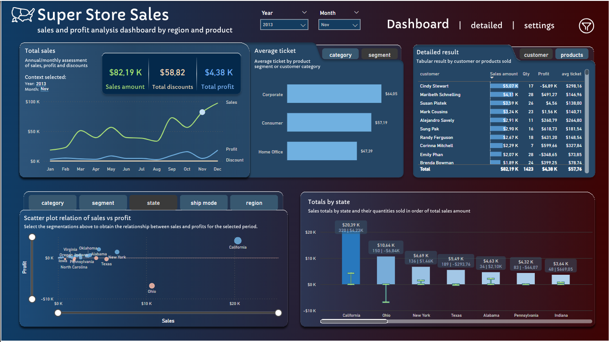

# Super-Store-Sales---Power-BI-dashboard

### This is a data analysis project developed with Power BI and is the final part of the data warehouse construction project with Databricks and Snowflake SuperStoreSales, which can be accessed through this [link](https://github.com/TiagoBHeck/SuperStoreSales).

## Objective

#### The goal of this data analysis project is to work on certain aspects that provide practical data storytelling elements. In this Power BI, it will be possible to observe how the user's selection context must be clearly highlighted at the time of analysis and how the visual components in the dashboards favor a dynamic analysis, providing clear information.

## Dashboard

#### The dashboard analyzes sales by relating the quantities sold to the profits obtained. The segments covered are: Products, customers and regions. The analysis are carried out on an annual basis with the possibility of monthly analysis.

&nbsp;

&nbsp;

### Semantic model

#### For the semantic model of this project, I chose to use a view created in Snowflake with all the categorical and quality information present together with the sales measures. This is a possibility for projects where there is not a large amount of data to be imported and the data models are more simplified.

&nbsp;

&nbsp;

### Main indicator

#### Dashboards are built to be iterable. Users who will consume the data in the dashboard need to be free to analyze the information in the graphs in different ways. Because of this, it is essential that the selected context is clear in the dashboard. If the analyses refer to a specific year or a specific month, this information needs to be clear to the user so that they do not get confused. This is one of the important parts of starting a good data storytelling.

&nbsp;

&nbsp;

### Dynamic analysis of profit and sales

#### Dashboards need to be built to allow for the analysis of metrics from different angles. For example: We can analyze the profitability of a specific product segment, but we can use the same indicator to analyze the profitability of a sales region. Dynamic analyses are essential for analyzing patterns and understanding behaviors. In the example below, the scatter plot chart shows the relationship between sales and profit. Segmentations allow the user to select which category they want to analyze.

&nbsp;

&nbsp;

### Tooltips and visual dynamism

#### Another important feature is the use of tooltips in visuals. This visual works incrementally, providing information that complements the main indicator. For example: If the main indicator analyzes revenue in monthly values, the tooltip can complement the analysis by providing the variation from the previous month and the growth in relation to last year. In the example in the image below, the tooltip emphasizes the data provided in the bar chart analyzing sales by state, providing the profit margin and unit sales quantity.

&nbsp;

&nbsp;

## Conclusion

#### Super Store Sales is a project that encompasses the entire journey of the data analyst in their routine regarding data extraction at its source until the visual presentation considering selection contexts and other elements that facilitate good data storytelling. The graphic elements worked on in this Power BI project brought some of the important concepts for good data storytelling practices.

## Author
- Tiago Bratz Heck
##### Access my [LinkedIn](https://www.linkedin.com/in/tiago-analista-de-dados/) profile.

